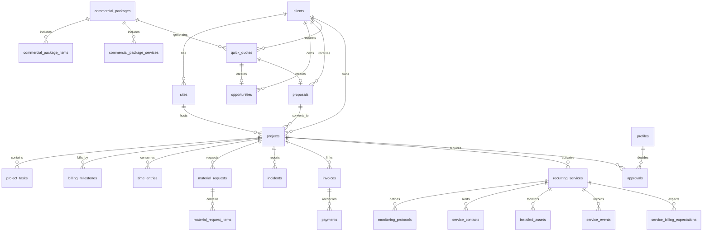

# Modelo de datos cloud - Assur Control

Objetivo: migrar gradualmente desde `localStorage` hacia PostgreSQL/Supabase sin perder compatibilidad con el MVP actual.

## Estrategia de migracion

1. Mantener `src/services/dataService.js` como punto unico de acceso a datos.
2. Usar `src/services/repositories.js` como capa sincronica de colecciones mientras el MVP sigue local.
3. Activar `src/services/supabaseRestAdapter.js` solo cuando existan tablas, RLS y Auth configurados.
4. Migrar primero entidades maestras y transaccionales simples.
5. Mantener importaciones Softland como datos de solo lectura hasta validar conciliacion.
6. Separar archivos pesados (fotos, firmas, PDF) hacia Storage.
7. Activar Row Level Security por rol antes de publicar.

## Adaptadores de datos

El codigo queda preparado con tres capas:

- `dataService`: contrato basico `get`, `set`, `remove`, `upsert`, `deleteById`, `append`.
- `repositories`: nombres de negocio por entidad para evitar claves `af_*` repartidas por la app.
- `supabaseRestAdapter`: adaptador transitorio para PostgREST/Supabase. Guarda colecciones JSONB en `app_collections` usando solo `anon key` publica y token de sesion de Supabase Auth.

Antes de activar cloud normalizado hay que evitar la sustitucion completa de tablas con `set` en datos compartidos. Para produccion madura, los repositorios deben evolucionar desde reemplazar listas completas hacia operaciones por fila: listar, crear, actualizar y eliminar.

La tabla `app_collections` es un puente pragmatico de publicacion: permite persistencia cloud rapida sin transformar aun todos los IDs y nombres de campos heredados. No reemplaza el modelo final; sirve para validar operacion multiusuario acotada antes de migrar por entidad.

El backend local agrega una capa intermedia con endpoints de dominio (`/api/entities/clientes`, `/api/entities/proyectos`, `/api/domain-backup`). Esta capa permite probar CRUD por entidad sin exponer las claves internas `af_*` al resto de la aplicacion. Cuando migremos a Supabase, esos endpoints deben evolucionar hacia tablas normalizadas manteniendo el mismo lenguaje de negocio.

## Tablas base

| Tabla | Uso | Origen actual | Prioridad |
| --- | --- | --- | --- |
| `profiles` | Usuarios, rol, estado, relacion con auth | `af_users` | Critica |
| `clients` | Clientes comerciales y Softland | `af_clientes` | Critica |
| `sites` | Instalaciones/sucursales | `af_instalaciones` | Critica |
| `opportunities` | Pipeline comercial | `af_oportunidades` | Alta |
| `quotes` | Cotizaciones tecnicas | `af_cotizaciones` | Alta |
| `commercial_packages` | Paquetes comerciales aprobados para venta rapida | `af_paquetes_comerciales` | Alta |
| `commercial_package_items` | Materiales/mano de obra incluidos por paquete | `paquetes.materialesIncluidos` | Alta |
| `commercial_package_services` | Servicios recurrentes incluidos por paquete | `paquetes.serviciosIncluidos` | Alta |
| `quick_quotes` | Cotizaciones rapidas generadas desde paquete | `af_quick_quotes` | Alta |
| `proposals` | Propuestas comerciales | `af_propuestas` | Critica |
| `projects` | Proyectos operativos | `af_proyectos` | Critica |
| `project_tasks` | Tareas tecnicas por etapa | `proyectos.tareas` | Critica |
| `time_entries` | Horas imputadas | `af_horas` | Alta |
| `field_clock_events` | Fichajes moviles/GPS | `af_fichajes` | Alta |
| `materials` | Catalogo y stock | `af_materiales` | Alta |
| `material_requests` | Solicitudes de terreno: estado, prioridad, solicitante, aprobacion y entrega | `proyectos.solicitudesMaterial` | Alta |
| `material_request_items` | Lineas de cada solicitud: material, cantidad, costo y entrega | `solicitudesMaterial.items` | Alta |
| `incidents` | Incidencias operativas | `af_incidencias` | Alta |
| `invoices` | Facturas/CxC Softland o manual | `af_facturas` | Critica |
| `payments` | Pagos/abonos | `af_pagos` | Critica |
| `accounts_payable` | CxP proveedores | `af_cuentas_pagar` | Critica |
| `billing_milestones` | Hitos de facturacion | `proyectos.hitosFacturacion` | Critica |
| `recurring_services` | Servicios recurrentes/monitoreo activo | `af_servicios_recurrentes` | Critica |
| `monitoring_protocols` | Protocolo basico por servicio/instalacion | `servicios.protocolo` | Alta |
| `service_contacts` | Contactos operativos y emergencia | `servicios.contactos` | Alta |
| `installed_assets` | Equipos instalados relevantes | `servicios.activos` | Media |
| `service_events` | Fallas/incidencias/reportes simples del servicio | nuevo | Media |
| `service_billing_expectations` | Facturacion mensual esperada conciliable con Softland | nuevo | Alta |
| `approvals` | Aprobaciones comerciales/operativas | `aprobaciones` embebidas | Media |
| `audit_logs` | Trazabilidad de cambios sensibles | nuevo | Media |
| `sync_logs` | Resultado de importaciones Softland | nuevo | Media |

## Relaciones principales



## Campos transversales recomendados

Todas las tablas operativas deben incluir:

- `id uuid primary key`
- `company_id uuid`
- `created_at timestamptz`
- `updated_at timestamptz`
- `created_by uuid`
- `updated_by uuid`
- `source text` con valores `manual`, `softland`, `import`, `system`
- `external_id text` para folios, codigos Softland o identificadores externos
- `metadata jsonb` para compatibilidad temporal con campos legacy

## Reglas iniciales de seguridad

- El frontend nunca guarda passwords, tokens Softland ni credenciales de base de datos.
- Supabase Auth maneja login y recuperacion de password.
- RLS filtra por `company_id`.
- Roles `admin`, `ops`, `supervisor`, `tecnico`, `almacen`, `viewer` se aplican en policies y en UI.
- Integracion Softland corre desde backend/serverless, no desde React.

## Migracion por tandas

| Tanda | Alcance | Resultado esperado |
| --- | --- | --- |
| 1 | Auth, profiles, clients, sites, projects | Multiusuario base con datos maestros compartidos. |
| 2 | proposals, opportunities, billing_milestones, recurring_services | Flujo comercial-operativo-recurrente persistente. |
| 3 | invoices, payments, accounts_payable, service_billing_expectations | Finanzas persistentes y conciliables con Softland. |
| 4 | tasks, time_entries, materials, incidents, protocols, contacts, assets | Operacion completa en nube. |
| 5 | storage, audit_logs, sync_logs, service_events | Publicacion segura y trazable. |
# Modelo Cloud ASSUR Control

## Estado Actual

El modelo cloud usa Supabase/PostgreSQL como destino productivo de bajo costo.
Softland se mantiene como fuente contable formal; ASSUR Control actúa como capa
operativa y gerencial.

La carpeta `supabase/` contiene:

- `schema.sql`: tablas mínimas normalizadas.
- `policies.sql`: base para Row Level Security.
- `storage.sql`: buckets futuros para evidencias, firmas, PDFs y fotos.
- `seed.preview.json`: vista previa generada desde los datos locales actuales.

## Validación De Migración

Antes de publicar o subir datos a Supabase:

```bash
npm run supabase:check
```

Este comando lee `server/data/app-data.json`, transforma las colecciones actuales
al modelo SQL normalizado y valida relaciones críticas. No escribe en Supabase.

Para generar un JSON de revisión:

```bash
npm run supabase:seed:preview
```

El archivo resultante queda en `supabase/seed.preview.json`.

Para generar SQL ejecutable en Supabase SQL Editor:

```bash
npm run supabase:seed:sql
```

El archivo resultante queda en `supabase/seed.preview.sql`.

Para validar que el esquema remoto publicado tiene las tablas mínimas esperadas:

```bash
npm run supabase:remote-schema:check
```

Nota: un `401` para tablas existentes es esperable con RLS/grants de producción cuando se consulta con `anon key` sin sesión. Un `404` indica que la tabla aún no existe o no está disponible en el schema cache de PostgREST.

## Decisión De Migración

La migración limpia relaciones opcionales inexistentes antes de construir el seed.
Esto evita que una referencia histórica incompleta bloquee la carga inicial en
PostgreSQL. La información original se conserva en `metadata` cuando corresponde.

## Próxima Implementación

1. Crear proyecto Supabase.
2. Ejecutar `supabase/schema.sql`.
3. Ejecutar `supabase/policies.sql`.
4. Ejecutar `supabase/storage.sql`.
5. Crear usuarios reales con Supabase Auth.
6. Cargar seed inicial usando el payload validado.
7. Cambiar frontend de modo demo/local a modo Supabase.

## Tablas Principales

- `clients`
- `sites`
- `opportunities`
- `proposals`
- `quotes`
- `projects`
- `project_tasks`
- `technicians`
- `materials`
- `material_requests`
- `time_entries`
- `field_clock_events`
- `incidents`
- `expenses`
- `invoices`
- `payments`
- `accounts_payable`
- `commercial_packages`
- `commercial_package_items`
- `commercial_package_services`
- `quick_quotes`
- `recurring_services`
- `monitoring_protocols`
- `service_contacts`
- `installed_assets`
- `service_events`
- `service_billing_expectations`
- `audit_logs`
- `sync_logs`

## Paquetes comerciales cloud

Los paquetes comerciales pasan de MVP local a modelo normalizado en Supabase.

Archivo incremental de montaje:

```bash
supabase/mount/11_commercial_packages_cloud.sql
```

Este SQL crea las tablas `commercial_packages`, `commercial_package_items`, `commercial_package_services` y `quick_quotes`, habilita RLS, agrega policies por compañía/rol comercial y registra triggers `updated_at`.

La app tolera que estas tablas aún no existan, para evitar pantalla blanca durante la transición. Sin embargo, la persistencia multiusuario formal de paquetes y cotizaciones rápidas se considera cerrada solo después de aplicar ese SQL en Supabase.

Estado validado:

- `npm run supabase:remote-schema:check`: confirma existencia de tablas remotas.
- `npm run qa:packages-cloud`: crea un flujo QA autenticado de paquete comercial normalizado, cotización rápida, oportunidad y propuesta.
- `npm run qa:cleanup-cloud`: elimina registros QA de paquetes, cotizaciones rápidas y flujo integral marcados como `QA CLOUD`, `qa-cloud-package-*` o `qa-flujo-*`.
